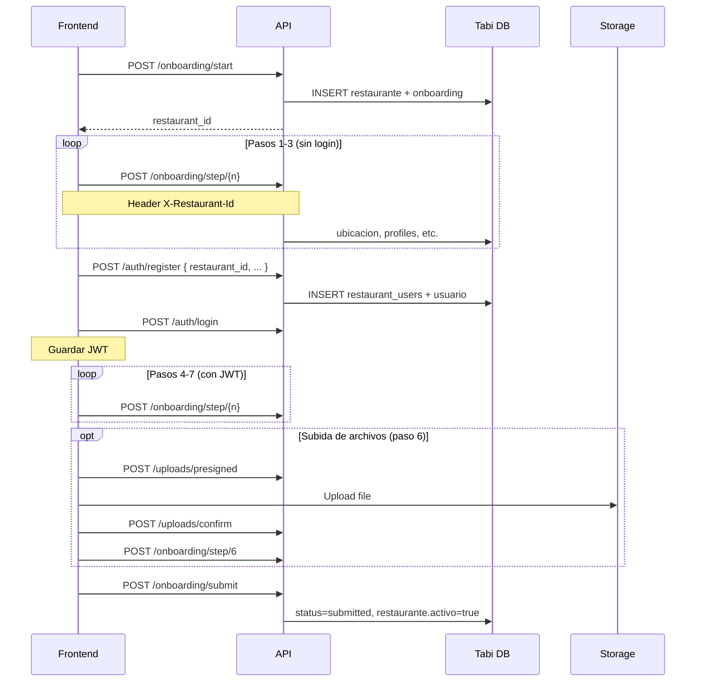

# API — Guía para Frontend

Documentación de integración del **Tabi Formulario Backend** para el equipo de frontend.

---

## Base URL

| Entorno | URL |
|---------|-----|
| Local | `http://localhost:8001` |
| Docker | `http://localhost:8001` |
| Producción | Configurar según despliegue (ej. `https://api.tabi.com`) |

Todos los endpoints viven bajo el prefijo `/api/v1`.

---

## Convenciones generales

### Formato de respuesta exitosa

Todas las respuestas exitosas usan el mismo envelope:

```json
{
  "success": true,
  "message": "Texto descriptivo",
  "data": { }
}
```

### Formato de error de la aplicación

Errores de negocio y auth (`TabiException`, `HTTPException`):

```json
{
  "success": false,
  "error": "Mensaje legible para el usuario",
  "code": "CODIGO_ERROR"
}
```

### Errores de validación (422)

Cuando el body no cumple el schema de Pydantic, FastAPI responde con su formato nativo (no usa el envelope):

```json
{
  "detail": [
    {
      "loc": ["body", "password"],
      "msg": "Password must contain at least one uppercase letter",
      "type": "value_error"
    }
  ]
}
```

### Headers comunes

| Header | Valor | Cuándo |
|--------|-------|--------|
| `Content-Type` | `application/json` | En todos los POST/PATCH con body |
| `X-Restaurant-Id` | `<restaurant_id>` | Pasos de onboarding, status y uploads **antes del login** |
| `Authorization` | `Bearer <access_token>` | Después del login; también válido en onboarding |

### CORS

El backend acepta orígenes configurados en `CORS_ORIGINS`. En local suele ser:

```
http://localhost:3000,http://localhost:5173
```

`allow_credentials: true` — se pueden enviar cookies si las usan en el futuro.

---

## Flujo general (restaurante primero, usuario después)

El wizard sigue el orden del negocio: **primero se crea el restaurante**, luego el dueño se registra vinculado a ese restaurante.

```
1. POST /onboarding/start           → crea restaurante (público)
2. POST /onboarding/step/{1-7}    → con header X-Restaurant-Id
3. GET  /onboarding/status          → con header X-Restaurant-Id
4. POST /auth/register              → requiere restaurant_id del paso 1
5. POST /auth/login                 → obtiene JWT
6. POST /onboarding/submit          → requiere JWT (usuario ya registrado)
```

Guarda `restaurant_id` en el estado del front (localStorage / contexto) desde el paso 1 hasta el registro.

### Integración con base de datos Tabi

| Acción del API | Tablas que escribe |
|----------------|-------------------|
| `POST /onboarding/start` | `restaurante`, `restaurant_onboarding_progress` |
| Paso 1 | `restaurant_profiles`, `restaurante.nombre` |
| Paso 2 | `ubicacion`, `restaurante.id_ubicacion`, `restaurante.direccion` |
| Paso 3 | `restaurant_contacts`, `restaurante.telefono` |
| Paso 4 | `restaurant_features`, `horarios`, `restaurante.horarios` |
| `POST /auth/register` | `restaurant_users`, `usuario` (con `id_restaurante`) |
| `POST /onboarding/submit` | `restaurant_onboarding_progress`, `restaurante.activo = true` |

---

## Autenticación

### Flujo de sesión (después del registro)

```
1. POST /auth/login     → obtener access_token + refresh_token
2. Guardar tokens (memoria / httpOnly cookie / secure storage)
3. En requests autenticados: Authorization: Bearer <access_token>
4. Si 401 por token expirado → POST /auth/refresh con refresh_token
5. POST /auth/logout al cerrar sesión
```

### Tokens

| Token | Duración por defecto | Uso |
|-------|---------------------|-----|
| `access_token` | 15 minutos (`expires_in: 900`) | Header `Authorization` |
| `refresh_token` | 7 días | Solo en `/auth/refresh` y `/auth/logout` |

El JWT incluye en el payload: `sub` (user id), `role`, `restaurant_id`.

### Roles

| Rol | Descripción |
|-----|-------------|
| `owner` | Dueño de restaurante — flujo de onboarding |
| `admin` | Acceso a vista completa de cualquier restaurante |

---

## Rate limiting

| Ruta | Límite |
|------|--------|
| `POST /auth/register` | 5 req/min por IP |
| `POST /auth/login` | 5 req/min por IP |
| `POST /auth/refresh` | 10 req/min por IP |
| Resto de rutas | 60 req/min por IP |

Respuesta al exceder límite — **429**:

```json
{
  "success": false,
  "error": "Too many requests",
  "code": "RATE_LIMIT_EXCEEDED"
}
```

Header: `Retry-After: 60`

---

## Códigos de error

| HTTP | code | Cuándo |
|------|------|--------|
| 400 | `BAD_REQUEST` | Falta `X-Restaurant-Id`, paso inválido, onboarding ya enviado, etc. |
| 401 | `UNAUTHORIZED` | Sin token, token inválido/expirado, credenciales incorrectas |
| 403 | `FORBIDDEN` | Sin permisos (ej. endpoint admin) |
| 404 | `NOT_FOUND` | Recurso no encontrado (ej. onboarding no iniciado) |
| 409 | `CONFLICT` | Email ya registrado o restaurante ya tiene dueño |
| 422 | — | Validación de campos (formato FastAPI) |
| 429 | `RATE_LIMIT_EXCEEDED` | Demasiadas peticiones |
| 500 | `INTERNAL_ERROR` | Error interno |

---

## Endpoints

### Health

#### `GET /api/v1/health`

Sin autenticación. Útil para verificar que el servicio está vivo.

**Response 200**

```json
{
  "success": true,
  "data": {
    "status": "healthy",
    "version": "1.0.0",
    "environment": "development",
    "redis": "ok"
  },
  "message": "Service is running"
}
```

---

## Auth

### `POST /api/v1/auth/register`

Crea la cuenta del dueño **vinculada a un restaurante ya iniciado**.

Requiere haber llamado antes a `POST /onboarding/start`. Crea registros en `restaurant_users` (JWT) y `usuario` (ecosistema Tabi).

**Auth:** No  
**Status:** `201`

**Body**

```json
{
  "restaurant_id": 42,
  "email": "owner@restaurant.com",
  "password": "SecurePass1",
  "full_name": "Juan Pérez"
}
```

| Campo | Tipo | Reglas |
|-------|------|--------|
| `restaurant_id` | int | ID devuelto por `POST /onboarding/start` |
| `email` | string | Email válido |
| `password` | string | 8–128 chars, al menos 1 mayúscula, 1 minúscula, 1 dígito |
| `full_name` | string | 2–255 chars |

**Response 201**

```json
{
  "success": true,
  "message": "Registration successful. Please verify your email.",
  "data": {
    "id": 1,
    "email": "owner@restaurant.com",
    "full_name": "Juan Pérez",
    "role": "owner",
    "is_active": true,
    "is_verified": false,
    "restaurant_id": 42
  }
}
```

**Errores:**
- `400 BAD_REQUEST` — onboarding no iniciado para ese `restaurant_id`
- `404 NOT_FOUND` — `restaurant_id` no existe en `restaurante`
- `409 CONFLICT` — email ya registrado o el restaurante ya tiene dueño

---

### `POST /api/v1/auth/login`

**Auth:** No

**Body**

```json
{
  "email": "owner@restaurant.com",
  "password": "SecurePass1"
}
```

**Response 200**

```json
{
  "success": true,
  "message": "Login successful",
  "data": {
    "access_token": "eyJhbGciOiJIUzI1NiIs...",
    "refresh_token": "raw-opaque-token-string",
    "token_type": "bearer",
    "expires_in": 900
  }
}
```

**Errores:** `401 UNAUTHORIZED` — credenciales inválidas o cuenta deshabilitada.

---

### `POST /api/v1/auth/refresh`

Renueva ambos tokens. El refresh token anterior queda invalidado (rotación).

**Auth:** No

**Body**

```json
{
  "refresh_token": "raw-opaque-token-string"
}
```

**Response 200** — mismo shape que login (`TokenResponse`).

**Errores:** `401` si el refresh token es inválido o expiró.

---

### `POST /api/v1/auth/logout`

Revoca el refresh token en servidor.

**Auth:** No

**Body**

```json
{
  "refresh_token": "raw-opaque-token-string"
}
```

**Response 200**

```json
{
  "success": true,
  "message": "Logged out successfully",
  "data": null
}
```

---

### `GET /api/v1/auth/me`

Devuelve el usuario autenticado.

**Auth:** Bearer token

**Response 200**

```json
{
  "success": true,
  "message": "OK",
  "data": {
    "id": 1,
    "email": "owner@restaurant.com",
    "full_name": "Juan Pérez",
    "role": "owner",
    "is_active": true,
    "is_verified": false,
    "restaurant_id": 1
  }
}
```

---

## Onboarding

### Flujo del wizard (7 pasos)

```
start → step/1..N → register → login → step/N..7 → submit
```

Recomendación UX: llamar `register` después del paso 3 (contacto), cuando ya tienes email del dueño. Los pasos 4–7 pueden hacerse con JWT o seguir con `X-Restaurant-Id`.

| Paso | Obligatorio | Peso | Descripción |
|------|-------------|------|-------------|
| 1 | Sí | 20% | Información básica del restaurante |
| 2 | Sí | 20% | Ubicación |
| 3 | Sí | 20% | Contacto |
| 4 | No | 10% | Operaciones (horarios, capacidad) |
| 5 | No | 10% | Características y servicios |
| 6 | No | 10% | Archivos (keys de storage) |
| 7 | No | 10% | Plan de suscripción |

- **Mínimo para enviar:** pasos 1, 2 y 3 completos (60%).
- **Máximo:** 100% con los 7 pasos.
- Tras `submit`, el onboarding pasa a `submitted` y **no se puede editar**.

Estados posibles de `status`: `draft`, `submitted`.

### Acceso a endpoints de onboarding

| Endpoint | Antes del login | Después del login |
|----------|-----------------|-------------------|
| `POST /onboarding/start` | ✅ Público | ✅ Público |
| `POST/PATCH /onboarding/step/*` | `X-Restaurant-Id` | `Authorization` o `X-Restaurant-Id` |
| `GET /onboarding/status` | `X-Restaurant-Id` | `Authorization` o `X-Restaurant-Id` |
| `POST /onboarding/submit` | ❌ Requiere JWT | ✅ JWT |
| Uploads | `X-Restaurant-Id` | `Authorization` o `X-Restaurant-Id` |

---

### `POST /api/v1/onboarding/start`

Crea el restaurante en `restaurante` y abre la sesión de onboarding. **Primer paso del flujo — no requiere login.**

**Auth:** No  
**Status:** `201`

**Body:** vacío

**Response 201**

```json
{
  "success": true,
  "message": "Onboarding started",
  "data": {
    "restaurant_id": 42,
    "message": "Onboarding started"
  }
}
```

**Importante:** guarda `restaurant_id` en el front. Lo usarás en:
- Header `X-Restaurant-Id` en pasos y status
- Body de `POST /auth/register`

---

### `POST /api/v1/onboarding/step/{step_number}`

Guarda un paso completo (create/upsert).

**Auth:** `X-Restaurant-Id: <restaurant_id>` **o** Bearer token  
**Path param:** `step_number` — entero del 1 al 7

**Bodies por paso:**

#### Paso 1 — Información básica

```json
{
  "restaurant_name": "La Parrilla",
  "legal_name": "La Parrilla SAS",
  "restaurant_type": "casual",
  "description": "Restaurante de carnes a la parrilla",
  "website": "https://laparrilla.com",
  "social_links": {
    "instagram": "https://instagram.com/laparrilla",
    "facebook": "https://facebook.com/laparrilla"
  }
}
```

`restaurant_type`: `casual` | `fine_dining` | `fast_casual` | `cafe` | `bar` | `food_truck` | `other`

`social_links` keys permitidas: `instagram`, `facebook`, `twitter`, `tiktok`, `youtube`, `linkedin`

#### Paso 2 — Ubicación

```json
{
  "country": "Colombia",
  "city": "Bogotá",
  "address": "Calle 100 #15-20",
  "lat": 4.6872,
  "lng": -74.0447
}
```

`lat` / `lng` son opcionales.

#### Paso 3 — Contacto

```json
{
  "owner_name": "Juan Pérez",
  "email": "owner@restaurant.com",
  "phone": "+573001234567"
}
```

`phone` debe ser E.164. El backend lo normaliza (ej. `+573001234567`).

#### Paso 4 — Operaciones (opcional)

```json
{
  "opening_hours": "09:00:00",
  "closing_hours": "22:00:00",
  "seating_capacity": 80,
  "number_tables": 20
}
```

`closing_hours` debe ser posterior a `opening_hours`. Formato de hora: `HH:MM:SS`.

#### Paso 5 — Características (opcional)

```json
{
  "reservation_types": ["online", "walk_in"],
  "cuisine_types": ["colombiana", "parrilla"],
  "services_offered": ["parking", "wifi", "terrace"]
}
```

`reservation_types`: `online` | `phone` | `walk_in` | `third_party` (mín. 1)

`cuisine_types`: máx. 5 strings

`services_offered`: `parking` | `wifi` | `terrace` | `private_room` | `accessibility` | `live_music` | `catering` | `delivery` | `takeaway`

#### Paso 6 — Archivos (opcional)

Referencia keys obtenidas del flujo de uploads (no sube archivos directamente aquí).

```json
{
  "logo_key": "restaurants/1/logo/abc123_logo.png",
  "cover_image_keys": [
    "restaurants/1/cover/def456_cover1.jpg",
    "restaurants/1/cover/ghi789_cover2.jpg"
  ],
  "document_keys": [
    "restaurants/1/business_doc/jkl012_rut.pdf"
  ]
}
```

`cover_image_keys`: máx. 5 elementos.

#### Paso 7 — Plan (opcional)

```json
{
  "plan": "pro",
  "billing_cycle": "monthly"
}
```

`plan`: `starter` | `pro` | `elite`  
`billing_cycle`: `monthly` | `annual`

---

**Response 200** (todos los pasos)

```json
{
  "success": true,
  "message": "Step 1 saved",
  "data": {
    "step": 1,
    "restaurant_id": 1,
    "completion_percentage": 20.0,
    "steps_completed": [1]
  }
}
```

**Errores comunes:**
- `400` — falta `X-Restaurant-Id` (sin JWT), paso fuera de rango (1–7) u onboarding ya enviado
- `404` — onboarding no iniciado (`/start` primero) o `restaurant_id` inválido
- `422` — campos inválidos según el paso

---

### `PATCH /api/v1/onboarding/step/{step_number}`

Misma lógica y mismo body que `POST`. Útil para re-guardar un paso ya completado (mientras `status !== "submitted"`).

**Response 200** — mismo shape que POST, con `message`: `"Step N updated"`.

---

### `GET /api/v1/onboarding/status`

Progreso actual del wizard. Cacheado en Redis ~60 s.

**Auth:** `X-Restaurant-Id` **o** Bearer token

**Response 200**

```json
{
  "success": true,
  "message": "OK",
  "data": {
    "restaurant_id": 42,
    "current_step": 4,
    "completion_percentage": 60.0,
    "status": "draft",
    "steps_completed": [1, 2, 3],
    "last_saved_at": "2026-06-08T20:15:30.123456+00:00"
  }
}
```

**Errores:**
- `400` — falta `X-Restaurant-Id` (sin JWT)
- `404` — no se ha llamado a `/start` o `restaurant_id` no existe

---

### `POST /api/v1/onboarding/submit`

Envío final. Requiere pasos 1, 2 y 3 completos y **usuario registrado** (JWT).

**Auth:** Bearer token (obligatorio)  
**Body:** vacío

**Response 200**

```json
{
  "success": true,
  "message": "Onboarding submitted successfully. Our team will review it shortly.",
  "data": {
    "restaurant_id": 1,
    "status": "submitted",
    "message": "Onboarding submitted successfully. Our team will review it shortly."
  }
}
```

**Errores:**
- `400` — faltan pasos obligatorios, ya fue enviado, o usuario sin `restaurant_id`
- `401` — sin JWT
- `404` — onboarding no existe

---

### `GET /api/v1/onboarding/{restaurant_id}`

Vista completa para administradores.

**Auth:** Bearer token con rol `admin`

**Response 200**

```json
{
  "success": true,
  "message": "OK",
  "data": {
    "restaurant_id": 1,
    "status": "submitted",
    "current_step": 7,
    "completion_percentage": 100.0,
    "profile": {
      "id": 1,
      "restaurant_id": 1,
      "legal_name": "La Parrilla SAS",
      "restaurant_type": "casual",
      "description": "...",
      "website": "https://laparrilla.com/",
      "social_links": { "instagram": "..." }
    },
    "contact": {
      "id": 1,
      "restaurant_id": 1,
      "owner_name": "Juan Pérez",
      "email": "owner@restaurant.com",
      "phone": "+573001234567"
    },
    "features": {
      "id": 1,
      "restaurant_id": 1,
      "reservation_types": ["online", "walk_in"],
      "cuisine_types": ["colombiana"],
      "services_offered": ["wifi"],
      "seating_capacity": 80,
      "number_tables": 20
    },
    "documents": [
      {
        "id": 1,
        "restaurant_id": 1,
        "document_type": "logo",
        "file_url": "https://...",
        "file_name": "logo.png",
        "file_size": 102400,
        "mime_type": "image/png",
        "storage_key": "restaurants/1/logo/...",
        "uploaded_at": "2026-06-08T20:10:00+00:00"
      }
    ],
    "subscription": {
      "id": 1,
      "restaurant_id": 1,
      "plan": "pro",
      "billing_cycle": "monthly",
      "status": "trial",
      "started_at": null,
      "expires_at": null
    }
  }
}
```

Campos anidados pueden ser `null` si el paso no se completó.

**Errores:** `403 FORBIDDEN` si el usuario no es admin.

---

## Uploads

Flujo de subida de archivos en 3 pasos:

```
1. POST /uploads/presigned  → obtener upload_url + storage_key
2. PUT/POST al upload_url   → subir archivo al storage (Supabase/S3)
3. POST /uploads/confirm    → registrar el archivo en la BD
4. Usar storage_key en paso 6 del onboarding
```

### Tipos y límites

| document_type | Uso típico | MIME permitidos |
|---------------|------------|-----------------|
| `logo` | Logo del restaurante | `image/jpeg`, `image/png`, `image/webp` |
| `cover` | Fotos de portada | `image/jpeg`, `image/png`, `image/webp` |
| `business_doc` | Documentos legales | `image/jpeg`, `image/png`, `image/webp`, `application/pdf` |

Tamaño máximo: **10 MB** por archivo (`MAX_FILE_SIZE_MB`).

---

### `POST /api/v1/uploads/presigned`

**Auth:** `X-Restaurant-Id` **o** Bearer token

**Body**

```json
{
  "file_name": "logo.png",
  "content_type": "image/png",
  "document_type": "logo"
}
```

**Response 200**

```json
{
  "success": true,
  "message": "Presigned URL generated",
  "data": {
    "upload_url": "https://...supabase.co/storage/v1/upload/restaurants/1/logo/abc_logo.png?token=...",
    "storage_key": "restaurants/1/logo/abc_logo.png",
    "expires_in": 3600,
    "fields": {
      "Content-Type": "image/png",
      "x-amz-meta-restaurant-id": "1",
      "x-amz-meta-document-type": "logo"
    }
  }
}
```

`fields` puede usarse si el storage requiere campos adicionales en multipart upload.

---

### `POST /api/v1/uploads/confirm`

Confirma que el archivo se subió correctamente al storage.

**Auth:** `X-Restaurant-Id` **o** Bearer token

**Body**

```json
{
  "storage_key": "restaurants/1/logo/abc_logo.png",
  "file_name": "logo.png",
  "file_size": 102400,
  "mime_type": "image/png",
  "document_type": "logo"
}
```

**Response 200**

```json
{
  "success": true,
  "message": "Upload confirmed",
  "data": {
    "document_id": 1,
    "storage_key": "restaurants/1/logo/abc_logo.png",
    "file_url": "https://.../restaurants/1/logo/abc_logo.png",
    "document_type": "logo"
  }
}
```

**Errores:**
- `400` — MIME no permitido, archivo muy grande, o `storage_key` ya confirmado

---

## Ejemplo de cliente (TypeScript + fetch)

```typescript
const API_BASE = import.meta.env.VITE_API_URL ?? "http://localhost:8001";

type ApiResponse<T> = {
  success: boolean;
  message: string;
  data: T;
};

type ApiError = {
  success: false;
  error: string;
  code: string;
};

class OnboardingClient {
  private restaurantId: number | null = null;
  private accessToken: string | null = null;
  private refreshToken: string | null = null;

  private async request<T>(
    path: string,
    options: RequestInit = {},
    requireRestaurant = false
  ): Promise<ApiResponse<T>> {
    const headers: HeadersInit = {
      "Content-Type": "application/json",
      ...(options.headers ?? {}),
    };

    if (this.accessToken) {
      headers["Authorization"] = `Bearer ${this.accessToken}`;
    } else if (requireRestaurant && this.restaurantId) {
      headers["X-Restaurant-Id"] = String(this.restaurantId);
    }

    const res = await fetch(`${API_BASE}${path}`, { ...options, headers });

    if (res.status === 401 && this.refreshToken && !path.includes("/auth/")) {
      await this.refresh();
      return this.request<T>(path, options, requireRestaurant);
    }

    const body = await res.json();
    if (!res.ok) throw body as ApiError;
    return body as ApiResponse<T>;
  }

  /** Paso 1 del flujo — sin login */
  async startOnboarding() {
    const res = await this.request<{ restaurant_id: number }>(
      "/api/v1/onboarding/start",
      { method: "POST" }
    );
    this.restaurantId = res.data.restaurant_id;
    localStorage.setItem("onboarding_restaurant_id", String(this.restaurantId));
    return res;
  }

  resumeRestaurantId() {
    const saved = localStorage.getItem("onboarding_restaurant_id");
    if (saved) this.restaurantId = Number(saved);
  }

  saveStep(step: number, data: Record<string, unknown>) {
    return this.request(
      `/api/v1/onboarding/step/${step}`,
      { method: "POST", body: JSON.stringify(data) },
      true
    );
  }

  getStatus() {
    return this.request("/api/v1/onboarding/status", {}, true);
  }

  async register(email: string, password: string, fullName: string) {
    if (!this.restaurantId) throw new Error("Call startOnboarding() first");
    return this.request("/api/v1/auth/register", {
      method: "POST",
      body: JSON.stringify({
        restaurant_id: this.restaurantId,
        email,
        password,
        full_name: fullName,
      }),
    });
  }

  async login(email: string, password: string) {
    const res = await this.request<{
      access_token: string;
      refresh_token: string;
    }>("/api/v1/auth/login", {
      method: "POST",
      body: JSON.stringify({ email, password }),
    });
    this.accessToken = res.data.access_token;
    this.refreshToken = res.data.refresh_token;
    return res;
  }

  async refresh() {
    const res = await this.request<{
      access_token: string;
      refresh_token: string;
    }>("/api/v1/auth/refresh", {
      method: "POST",
      body: JSON.stringify({ refresh_token: this.refreshToken }),
    });
    this.accessToken = res.data.access_token;
    this.refreshToken = res.data.refresh_token;
  }

  submit() {
    return this.request("/api/v1/onboarding/submit", { method: "POST" });
  }
}
```

---

## Diagrama de flujo completo



---

## Notas para integración

1. **Orden obligatorio:** `start` → pasos → `register` → `login` → `submit`. No se puede registrar sin `restaurant_id`.
2. **Persistencia local:** Guarda `restaurant_id` en `localStorage` por si el usuario recarga la página antes de registrarse.
3. **Header `X-Restaurant-Id`:** Obligatorio en pasos/status/uploads mientras no haya JWT.
4. **Reintentos:** Implementar refresh automático del access token (`expires_in` en segundos).
5. **Validación en front:** Replicar reglas básicas (password, teléfono E.164, horarios) para UX; el backend siempre valida de nuevo.
6. **Producción:** `/docs` y `/redoc` están deshabilitados cuando `ENVIRONMENT=production`.
7. **Paso 2 (ubicación):** También escribe en `ubicacion` y enlaza `restaurante.id_ubicacion`.
8. **Un dueño por restaurante:** `POST /auth/register` falla con `409` si el restaurante ya tiene usuario vinculado.

---

## Variables de entorno relevantes para el front

Solo necesitan configurar la URL base en su `.env`:

```env
VITE_API_URL=http://localhost:8001
# o
NEXT_PUBLIC_API_URL=http://localhost:8001
```

El backend debe tener `CORS_ORIGINS` con la URL exacta del frontend.
